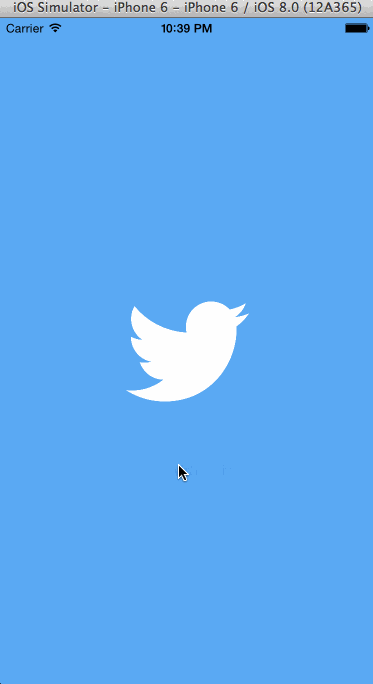

iOS Twitter App 
============================

Implemented User Stories
------------------------

- [x] User can sign in to Twitter using OAuth 1.0a login flow.
- [x] User can view 20 tweets from their home timeline.
- [x] The current signed in user will be persisted across restarts.
- [x] In the home timeline, user can view tweet with the user profile picture, username, tweet text, and timestamp. Model Classes were enhanced.
- [x] User can pull to refresh.
- [x] User can compose a new tweet by tapping on a New button.
- [x] User can tap on a tweet to view it, with controls to retweet, favorite, and reply.
- [x] Optional: When composing, you should have a countdown in the upper right for the tweet limit.
- [x] Optional: Retweeting and favoriting increment the retweet and favorite count.
- [x] Optional: Unfavorite will decrement the retweet and favorite count.
- [x] Optional: Replies should be prefixed with the username and the Reply_id should be set when posting the tweet
- [ ] Optional: User can load more tweets once they reach the bottom of the feed using infinite loading similar to the actual Twitter client.

Time Taken : 20 Hrs

Screen Capture
--------------

